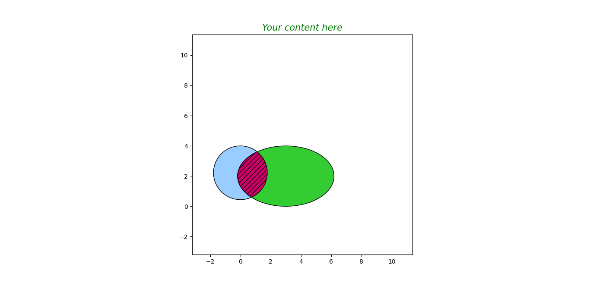

# Intersection area of ellipse and circle using Python
Piece of code demonstrate only for the intersection of circle and ellipse.

Download the ZIP

## Required Packages:
1. matplotlib
2. descartes
3. shapely
4. numpy

## Download of packages:
Open cmd and type ```pip --version``` (to check pip is installed)
Install the following packages using cmd.
1. ```pip install matplotlib```
2. ```pip install descartes```
3. ```pip install shapely```
4. ```pip install numpy```

## Modify patch.py of descartes
Navigate to this path "C:\Users\yourusername\AppData\Local\Programs\Python\Python310\Lib\site-packages\descartes"
and open the 'patch.py' file using vscode and modify line 62 ```t.exterior``` to ```t.exterior.coords```

Save the file and close the window.

## Run script
Debug and run the 'area_of_intersection.py' file.

## Output


## Bug? 
contact email: dsubham776@gmail.com
